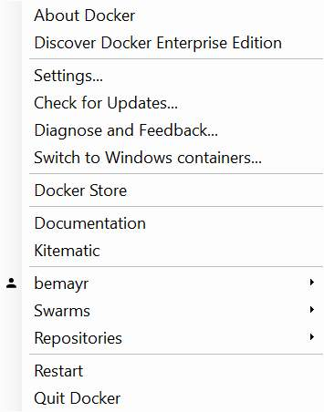
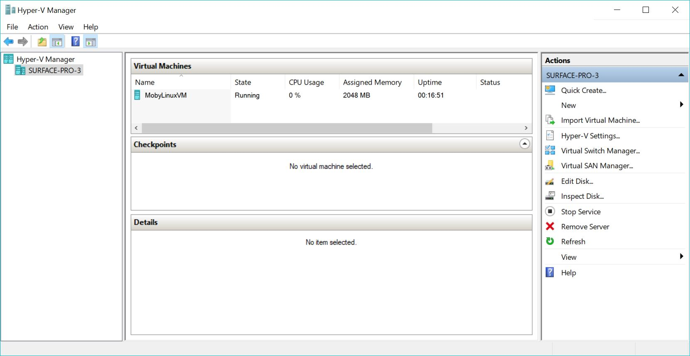
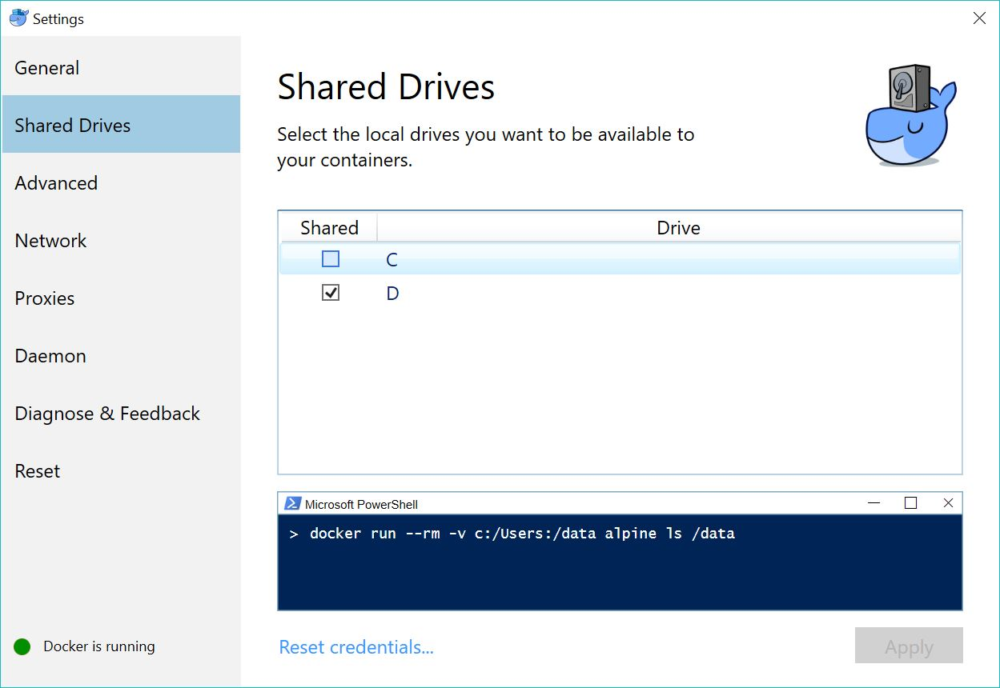
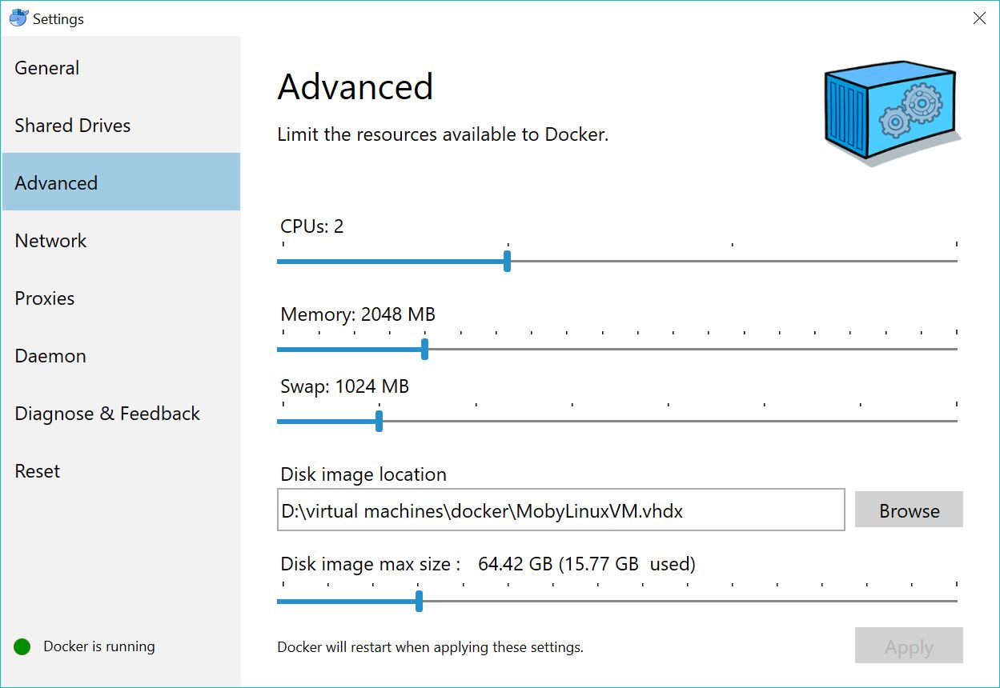

# Docker for Windows
Installing [Docker for Windows](https://www.docker.com/docker-windows) will give you the following *whale*-icon in your taskbar:

Right clicking the icon presents you the following menu.

Keep in mind that Docker for Windows creates a LinuxKit-VM which hosts the Docker Daemon.
The whole network and file sharing part is simplified in a way that you usually don't have to do anything by yourself.

Also keep in mind that you share your drives in the Docker-Settings to make them accessible for mounting shared folders.
Newer versions of Docker will automatically notify you if you try to mount something on an *un*shared drive.

In the advanced settings you can specify the resources your Docker-VM is allowed to allocate.
You can also change the location of the VM for storage reasons.

